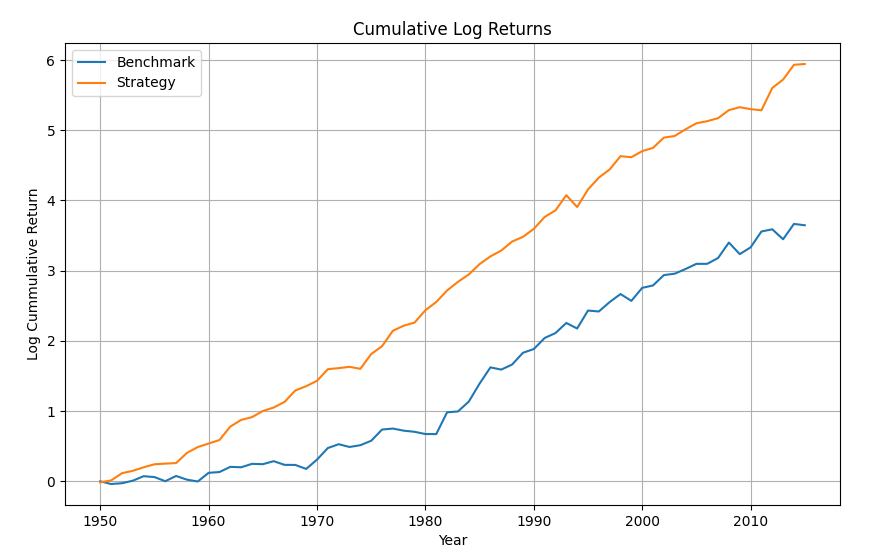

# Term Premium Harvesting Strategy
#### Birju Patel

Using the [Jordà-Schularick-Taylor Macrohistory Database](https://www.macrohistory.net/data/), I test the viability of a strategy for trading global bonds.

In **Fama (1986)**, it was shown that the spread between a country's bond yields and bill rates positively correlates with the **excess return** of its bonds over bills.

This strategy exploits that relationship by:
- **Going long** the bonds and **short** the bills of the **3 countries** with the highest yield spreads each year.
- Combining this position with a **long allocation to U.S. Treasury bills** to replicate the duration of a long-only U.S. bond portfolio.

The strategy is benchmarked against the total return of **U.S. Treasury bonds**.

To see the results, first download this repository. Ensure that Python is installed on your machine. Then run the following command to install the required dependencies:

```
python -m pip install numpy pandas statsmodels matplotlib
```

The strategy has performed well historically. Below are the returns between 1950 and 2015.



| Metric                     | Strategy (Top 3 Term Premium) | Benchmark (US Bonds) |
|---------------------------|-------------------------------|----------------------|
| Mean Log Return           | 9.01%                         | 5.53%               |
| Std Dev (Log Return)      | 7.92%                         | 9.97%               |
| Sharpe Ratio              | 0.5212                        | 0.0651              |

---

## Scripts

- `backtest.py` — Backtests the strategy and plots cumulative returns vs. the benchmark  
- `cross_correlation.py` — Computes cross-country correlations of bond excess returns  
- `dispersion.py` — Displays the historical distribution of bond excess returns  
- `yield_spread_regression.py` — Regresses bond excess returns on lagged term spreads
